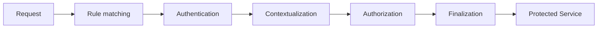
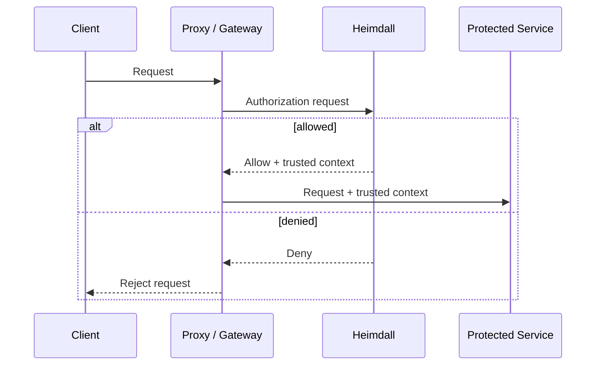
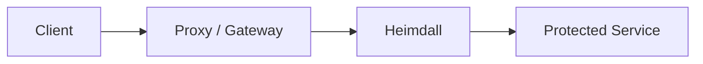

# Heimdall

**A cloud native Identity Aware Proxy and Access Control Decision service.**

Heimdall is a general-purpose Policy Enforcement Point (PEP) for HTTP services, designed for Zero Trust architectures as described in [NIST SP 800-207](https://csrc.nist.gov/pubs/sp/800/207/final). It combines authentication and authorization in a configurable pipeline, keeps access control close to the protected resource, and can provide services with trusted context derived from the authenticated subject and authorization process — without coupling them to concrete authentication protocols, identity providers, or authorization systems.

Heimdall can either:

* expose its access control decisions to an existing proxy, ingress controller, API gateway, or service mesh; or
* enforce them directly by proxying requests to the protected service, commonly as a sidecar or in front of a small group of services.

## How it works

Incoming requests are matched against declarative rules and processed by a configurable pipeline. A successful processing path typically looks like this:

Reusable mechanisms implement the individual steps.

This allows Heimdall to:

* authenticate requests using different identity providers and protocols;
* enrich authenticated subjects with additional context;
* authorize requests locally or through external authorization systems;
* provide protected services with trusted context generated by finalizers;
* let each protected service define its own access requirements through service-specific rules;
* establish secure defaults that service-specific rules inherit and that apply when no specific rule matches.

Learn more about [pipelines](https://dadrus.github.io/heimdall/dev/docs/concepts/pipelines/), [rules](https://dadrus.github.io/heimdall/dev/docs/concepts/rules/), and [mechanisms](https://dadrus.github.io/heimdall/dev/docs/concepts/mechanisms/).

## Deployment

Heimdall is built for cloud-native environments, supporting both standalone and Kubernetes-native deployments, with declarative configuration, dynamic policy updates, and built-in observability.

### Integrate with your existing proxy or gateway

Heimdall's Access Control Decision service is designed to integrate with existing proxies, ingress controllers, API gateways, and service meshes.

The surrounding infrastructure handles traffic management and routing, while Heimdall evaluates the applicable policy enforcement pipeline and returns the decision together with trusted context for the protected service.

Integration guides and examples are available for Caddy, Contour, Emissary Ingress,
Envoy, Envoy Gateway, HAProxy, Istio, KGateway, NGINX, and Traefik.

See all [proxy and gateway integration guides and examples](https://dadrus.github.io/heimdall/dev/guides/proxies/).

### Run Heimdall as a proxy

Heimdall can alternatively proxy the final hop to the protected service:

This is particularly useful for sidecar deployments or when one Heimdall instance protects a small group of services.

See [Operating Modes](https://dadrus.github.io/heimdall/dev/docs/concepts/operating_modes/) for details.

## Design principles

Heimdall is developed with four main goals:

* **Security** — preserve explicit trust boundaries and fail-closed behavior.
* **Performance** — minimize work and allocations on request-processing paths.
* **Clear abstractions** — keep authentication, authorization, contextualization, and finalization independent and replaceable.
* **Simplicity** — prefer straightforward solutions over unnecessary frameworks and abstractions.

## Getting started

New to Heimdall?

1. [Discover Heimdall](https://dadrus.github.io/heimdall/dev/docs/getting_started/discover_heimdall/)
2. [Protect an Application](https://dadrus.github.io/heimdall/dev/docs/getting_started/protect_an_app/)
3. [Install Heimdall](https://dadrus.github.io/heimdall/dev/docs/getting_started/installation/)
4. Explore the [Guides](https://dadrus.github.io/heimdall/dev/guides/)

The documentation contains the authoritative reference for configuration, mechanisms, rules, APIs, operations, and integrations.

## Project status

Heimdall is production-ready, actively developed, and used in production.

Check the [releases](https://github.com/dadrus/heimdall/releases) and
[upgrade and migration documentation](https://dadrus.github.io/heimdall/dev/docs/operations/migration/)
when upgrading.

## If you ...

* ... like the project — please give it a :star:
* ... miss something or found a bug, [file a ticket](https://github.com/dadrus/heimdall/issues). You are also very welcome to [contribute](https://github.com/dadrus/heimdall/blob/main/CONTRIBUTING.md) :wink:
* ... would like to financially support the development and maintenance of Heimdall, consider becoming a sponsor via [GitHub Sponsors](https://github.com/sponsors/dadrus) or [Open Collective](https://opencollective.com/heimdall-proxy)
* ... would like to support the project in another way, reach out to me via [Discord](https://discord.gg/qQgg8xKuyb)
* ... need help, head over to [Discord](https://discord.gg/qQgg8xKuyb) as well

## License

Heimdall is licensed under the [Apache License 2.0](LICENSE).
