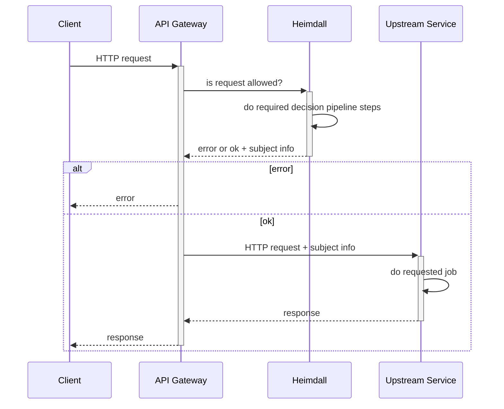
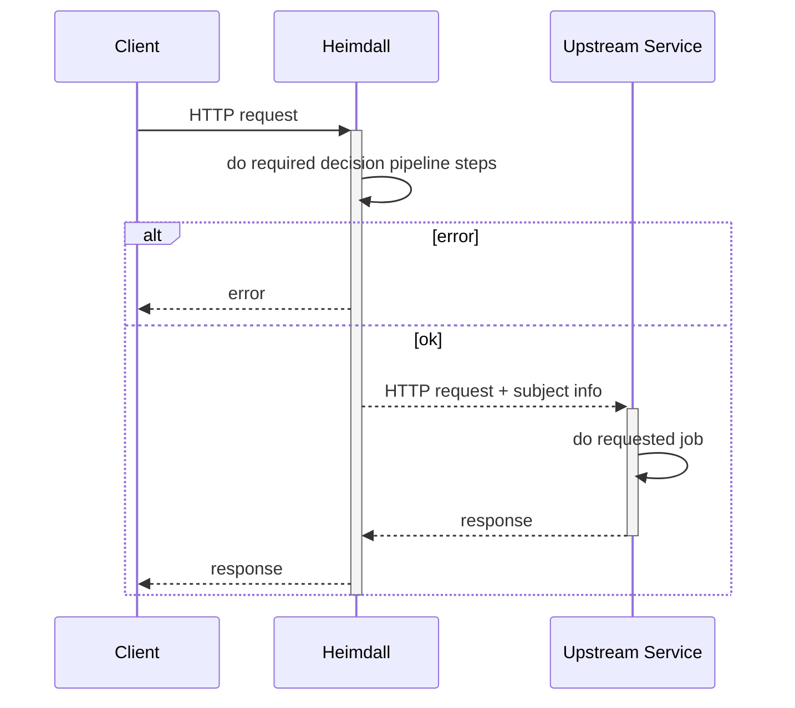
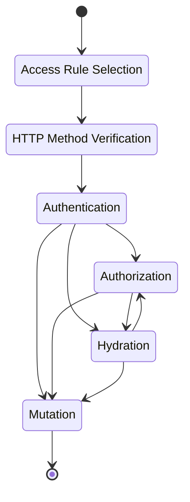

# Welcome

Heimdall is an open-source cloud native Identity & Access Proxy (IAP) and Access Control Decision API. Based on the requirements of your upstream API, it authenticates and authorizes incoming HTTP requests, enriches these with further information and transforms resulting subject information into the required format. It is supposed to be used either as a Reverse Proxy in front of your upstream API or web server that rejects unauthorized requests and forwards authorized ones to your end points, or as a Decision API, which integrates with your API Gateway (Kong, NGNIX, Envoy, Traefik, etc) and then acts as a Policy Decision Point.

## Operating Modes

### Decision API

### Reverse Proxy

## Decision Pipeline

Heimdall's decision pipeline consists of multiple steps depicted by the following diagram. If any of these fails, the pipeline ends with an error. Otherwise, none or multiple "Subject Information" objects (depends on the used hydrators) are returned to the caller (in the Decision API mode) or forwarded to the upstream service (in the Proxy mode).

1. **Access Rule Selection**: Rule selection is based on the URL (scheme, host, port and path) of the incoming HTTP request. You have to configure all of these in each rule using either regex or glob patterns. The information about the URL is taken either from the URL itself used to communicate with Heimdall, or from `X-Forwarded-Proto`, `X-Forwarded-Host` and `X-Forwarded-Uri` headers (if present) of the incoming request. The request is denied if no rules match. Exception to this pattern is the default rule, which, if configured, applies if no rules match. The configuration of the matched rule becomes the input for the next steps.
2. **HTTP Method Verification**: When a rule matches, Heimdall verifies, that the HTTP method is allowed for the given URL. The information about the HTTP method is taken either from the HTTP request method itself, or from the `X-Forwarded-Method` header (if present). The request is denied if the method does not match.
3. **Authentication**: Authentication is actually the first real step in the pipeline. Here Heimdall can validate the authentication status of the HTTP request using a variety of methods, like Cookie session, Basic Authentication, Bearer Token, etc. One can define multiple authentication mechanisms to have useful fallbacks. This step, if successful, results in a Subject object (consisting of an ID and the Attributes of the authenticated subject) which becomes input to the following steps. If this step fails, the request is denied.
4. **Authorization**: Beyond authentication, rules can optionally check permissions to secure APIs which require special privileges of the authenticated subject. As with authentication, Heimdall supports a variety of authorization mechanisms. Unlike the authentication step, multiple authentication mechanisms can be configured and are executed in sequence. Failed authorization result in a denied request.
5. **Hydration**: Another optional step in the pipeline is hydration. Here, the information received so far about the subject can be enriched by communicating with other systems and is made then available in the Attributes of Subject object. If hydration fails, the request is denied. As with authorization, multiple hydration mechanisms can be configured and executed in sequence.
6. **Mutation**: This is the last step in the pipeline. It transforms the information gathered in the previous steps into a format expected by the upstream service. The possible transformations vary from a Cookie, through a simple HTTP header to even a JSON Web Token. There are no limitations on the amount of transformations applied in this step.

> **NOTE**:
> Authorization and hydration steps can be defined in any order and even mixed and are executed in the order of their definition.

